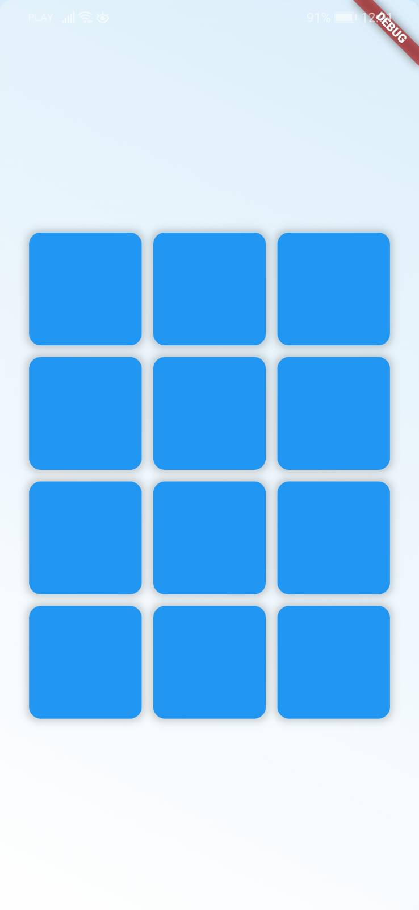

# Cognitive Assestment App

A simple mobile application to test cognitive abilities. The app is connected to the backend via Fast Api and the data is stored in a MongoDB database.

Backend repository:
https://github.com/neuropython/CognitiveGamesBackend

## views and functionalities

1. **Login and Register**

- User can login or register to the app.
  
  
  

2. **Home Page**
   

3. **Cognitive Games**

- User can choose from a list of cognitive games to play.
  

4. **Game 1: Card Memory Game**
   
   
   
   

5. **Game 2: Stroop Test Game**
   
   
   

6. **Game 3: Numbers Memory Game**
   
   

7. **Results**

- User after finishing the game can see the acording to the game results screen.
  

8. **Statistics**

- User can see the statistics of the games played.
  
